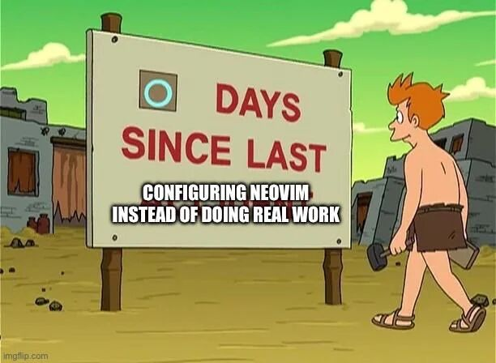

# Neovim 0.12 config (Arch Linux)

Обновлённый конфиг с заделом на переход с Doom Emacs.

---

## Установка

```bash
# Бэкап старого
mv ~/.config/nvim        ~/.config/nvim.bak
mv ~/.local/share/nvim   ~/.local/share/nvim.bak
mv ~/.local/state/nvim   ~/.local/state/nvim.bak
mv ~/.cache/nvim         ~/.cache/nvim.bak

# Кладём новый
unzip nvim.zip -d ~/.config/
# Должна появиться папка ~/.config/nvim/

# Запуск — lazy.nvim сам поставит всё
nvim
```

При первом запуске:

1. Lazy установит плагины.
2. Mason докачает LSP/форматтеры.
3. Treesitter скомпилирует парсеры.
4. `:checkhealth` .

---

## Зависимости системы (pacman)

```bash
# Обязательно
sudo pacman -S neovim git curl unzip ripgrep fd make gcc nodejs npm

# Для Ollama (локальные модели)
sudo pacman -S ollama
# Под AMD (ROCm):
sudo pacman -S ollama-rocm
systemctl --user enable --now ollama
# либо, если инстанс один на машину:
# sudo systemctl enable --now ollama

# Модели под  24 GB VRAM:
ollama pull qwen2.5-coder:7b
ollama pull qwen2.5-coder:32b
ollama pull deepseek-coder-v2:16b
ollama pull llama3.1:8b
ollama pull qwen3:14b  # сейчас на этом сижу.
```

Модель по умолчанию в `plugins/codecompanion.lua` => `schema.model.default`

### Nerd Font

Для иконок в lualine/bufferline/neo-tree нужен nerd-font:

```bash
sudo pacman -S ttf-hack-nerd-mono  # вроде так
```

---

## Структура

```
nvim/
├── init.lua                 точка входа
├── lazy-lock.json           (создастся автоматически)
└── lua/
    ├── core/
    │   ├── configs.lua      опции редактора, diagnostic
    │   ├── mappings.lua     глобальные кеймапы
    │   └── lazy.lua         bootstrap lazy.nvim
    └── plugins/
        ├── autopairs.lua
        ├── blink-cmp.lua    autocomplete (новый, быстрый)
        ├── bufferline.lua
        ├── codecompanion.lua  AI через локальную Ollama
        ├── comment.lua      <leader>- тогл
        ├── conform.lua      форматтеры (prettier/black/stylua)
        ├── dashboard.lua
        ├── gitsigns.lua
        ├── leap.lua
        ├── lsp.lua          vim.lsp.config / vim.lsp.enable (0.11+ API)
        ├── lualine.lua
        ├── mason.lua        установщик LSP/форматтеров
        ├── neo-tree.lua
        ├── neoscroll.lua    плавный скролл (240 Hz-дружелюбные тайминги)
        ├── onedark.lua
        ├── telescope.lua
        ├── toggleterm.lua
        ├── treesitter.lua
        └── which-key.lua
```

---

## Хоткеи (Leader = Space)

### Файлы / буферы

| Keys                | Действие                     |
| ------------------- | ---------------------------- |
| `<leader>w`         | Сохранить                    |
| `<leader>q`         | Закрыть окно                 |
| `<leader>Q`         | Выйти с `!`                  |
| `<leader>t`         | NeoTree toggle               |
| `<Tab>` / `<S-Tab>` | Следующий / предыдущий буфер |
| `<leader>x`         | Pick-close буфер             |
| `<C-x>`             | Закрыть все остальные буферы |

### Telescope (поиск)

| Keys         | Действие         |
| ------------ | ---------------- |
| `<leader>ff` | Find files       |
| `<leader>fw` | Live grep        |
| `<leader>fb` | Buffers          |
| `<leader>fh` | Help tags        |
| `<leader>fr` | Recent files     |
| `<leader>fd` | Diagnostics      |
| `<leader>fs` | Document symbols |

### LSP

| Keys         | Действие                        |
| ------------ | ------------------------------- |
| `gd` / `gD`  | Definition / Declaration        |
| `gi`         | Implementation                  |
| `gr`         | References                      |
| `K`          | Hover                           |
| `<C-k>`      | Signature help                  |
| `<leader>D`  | Type definition                 |
| `<leader>lr` | Rename                          |
| `<leader>la` | Code action                     |
| `<leader>lf` | Format (LSP)                    |
| `<leader>lF` | Format (conform, принудительно) |
| `<leader>le` | Показать диагностику строки     |
| `]d` / `[d`  | След / пред диагностика         |

### Комментирование

| Keys         | Действие                    |
| ------------ | --------------------------- |
| `<leader>-`  | Тогл строки / выделения     |
| `gcc`        | Тогл строки                 |
| `gc{motion}` | По моушену (`gcap` — абзац) |
| `gbc` / `gb` | Блочный комментарий         |

### AI (CodeCompanion / Ollama)

| Keys          | Действие                                         |
| ------------- | ------------------------------------------------ |
| `<leader>aa`  | Меню действий (объяснить, отрефакторить, тесты…) |
| `<leader>ac`  | Chat toggle (аналог gptel-menu)                  |
| `<leader>ai`  | Inline prompt по выделению                       |
| `<leader>ap`  | Prompt Library                                   |
| `ga` (visual) | Добавить выделение в активный чат                |

### Git (gitsigns)

| Keys         | Действие         |
| ------------ | ---------------- |
| `]c` / `[c`  | След / пред hunk |
| `<leader>gs` | Stage hunk       |
| `<leader>gr` | Reset hunk       |
| `<leader>gS` | Stage buffer     |
| `<leader>gR` | Reset buffer     |
| `<leader>gp` | Preview hunk     |
| `<leader>gb` | Blame line       |
| `<leader>gd` | Diff this        |

### Навигация / окна

| Keys          | Действие                |
| ------------- | ----------------------- |
| `<C-h/j/k/l>` | Между окнами            |
| `<A-arrow>`   | Ресайз окна             |
| `\|`          | Vsplit                  |
| `\`           | Split                   |
| `s` / `S`     | Leap forward / backward |

### Прочее

| Keys                      | Действие                                                |
| ------------------------- | ------------------------------------------------------- |
| `<C-\>`                   | Toggle terminal                                         |
| `<leader>?`               | Which-key: все доступные клавиши буфера                 |
| `<C-Space>`               | Начать выделение по синтаксису (treesitter incremental) |
| `<C-u>/<C-d>/<C-b>/<C-f>` | Плавный скролл                                          |

---

## LSP — что установится автоматически через Mason

| Сервер                  | Язык                 |
| ----------------------- | -------------------- |
| `lua_ls`                | Lua                  |
| `ts_ls`                 | JS / TS              |
| `html`                  | HTML                 |
| `cssls`                 | CSS                  |
| `tailwindcss`           | Tailwind             |
| `intelephense`          | PHP                  |
| `pyright`               | Python               |
| `emmet_language_server` | Emmet в HTML/JSX/PHP |

Форматтеры (тоже через Mason):
`stylua`, `prettierd`, `black`, `isort`, `php-cs-fixer`, `eslint_d`.

Автоформат включён при сохранении. Выключить:

- временно в буфере: `:FormatDisable!`
- глобально: `:FormatDisable`
- обратно: `:FormatEnable`

---

## nvim orgmode

| Действие      | Keys        |
| ------------- | ----------- |
|               |             |
| Смена статуса | cit         |
| Дедлайн       | <leader>odd |
| Schedule      | <leader>ods |
| Agenda        | <leader>oa  |
|               |             |
|               |             |
|               |             |

---

## Что поменялось по сравнению с старым конфигом

1. **nvim-cmp → blink.cmp** — быстрее, встроенные snippets (`vim.snippet`),
   rust-fuzzy-matcher.
2. **phpactor → intelephense** — качественный PHP LSP.
3. Добавлены **pyright**, **tailwindcss**, **emmet**.
4. **Comment.nvim** на `<leader>-`.
5. **CodeCompanion** под локальную Ollama (чат, inline, actions как gptel в emacs)
6. **neoscroll** с таймингами под 240 Hz.
7. **conform.nvim** для форматирования.
8. **nvim-autopairs**, **which-key**.
9. `core/configs.lua`: добавлен `undofile`, `signcolumn`, `smartcase`,
   `vim.diagnostic.config()` с signs через новый API (0.11+).
10. `core/mappings.lua`: `leader Q` — force quit all, visual J/K — двигать
    строки, visual `<`/`>` — indent с сохранением выделения.
11. Везде расставил lazy-загрузку (`event`, `keys`, `cmd`) — старт nvim
    ускоряется заметно.
12. Добавил nvim orgmode

---

## Troubleshooting

- **Treesitter ругается на парсер** → `:TSUpdate`
- **LSP не запускается** → `:LspInfo`, `:Mason`
- **CodeCompanion не отвечает** → `systemctl --user status ollama`,
  `curl http://127.0.0.1:11434/api/tags` (должен вернуть список моделей).
- **Blink.cmp: нет автокомплита** → `:checkhealth blink`;
  если ругается на rust-бинарь — `version = "1.*"` в
  `plugins/blink-cmp.lua` должен его подтянуть из релиза.
- **Иконки как `??`** → поставь nerd-font и выбери его в терминале.
- **Форматирование не срабатывает** → `:ConformInfo`
